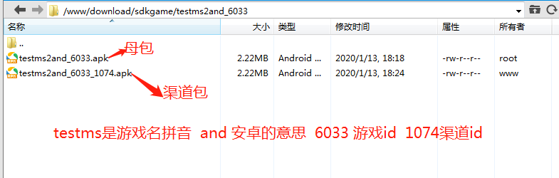

# subpackage

#### 介绍
1. 获取apk，ipa等母包信息。自动生成渠道包.
2. 支持母包分渠道包，渠道包下面再分子渠道包.
3. 项目主要是用来分渠道包，统计不同渠道子渠道的登录，充值情况.

#### 软件架构
>app-package 测试包文件夹 
>>mscqios_6026_1074.ipa ipa包
>>testms2and_6033_1077_1078.apk apk包
>pictrue 图片示例
>test
>>testApkparse.php apk解析示例
>>testIpaparse.php ipa解析示例   
>sub.php    入口文件

#### 安装教程

1. 从github克隆代码到本地
```git 
clone git@github.com:tyhlovecm/php-subpackage.git
```
2. 进入php-subpackage文件夹 安装项目所依赖的扩展包
```composer
composer install
```

#### 使用说明

1.  根据自己项目，设置DOWNLOAD_DIR,PLIST_TMP_PATH 保证目录读写权限.项目读取info.plist信息时 会产生info.plist 到临时目录PLIST_TMP_PATH.
2.  参数p 母包名 a 渠道包名 如果p=a 是生成母包参数，写入数据库 如果p!=$a则在母包基础上，打入渠道信息.
3.  项目区分安卓，ios 包方式可以自行定义。目前支持ipa，apk两种包信息读取以及打入渠道信息。如有其它需求请自行扩展.
4.  apk母包必须使用v1签名方式打包，不然可能出现渠道包安装不上的问题.
5.  包目录结构说明如下：


### 关键代码
```php
header('Content-type: application/json;charset=utf-8");');
define('DOWNLOAD_DIR', '/www/download/sdkgame/');//包存放目录
define('SUBPACKAGE_DIR', __DIR__.DIRECTORY_SEPARATOR."/subPackage");//需要用到的类
define('PLIST_TMP_PATH', '/tmp/tmp_dir');//info.plist临时产生目录

//接受参数
$params = json_decode(file_get_contents('php://input'), true);
//返回响应
response(subpackage($params));
```

### 包名命名说明
testms2 游戏拼音首字母  
and     安卓标识  
6033    游戏id  
1077    渠道id  
1078    1077的子渠道  


| 母包        | 渠道包 |  子渠道包  |
| --------   | -----:  | :----:  |
| testms2and_6033.apk     | testms2and_6033_1077.apk   |   testms2and_6033_1077_1078.apk     |


### 问题反馈
使用中遇到任何问题，欢迎及时反馈！

#### 参与贡献
1.  Fork 本仓库
2.  新建 Feat_xxx 分支
3.  提交代码
4.  新建 Pull Request
